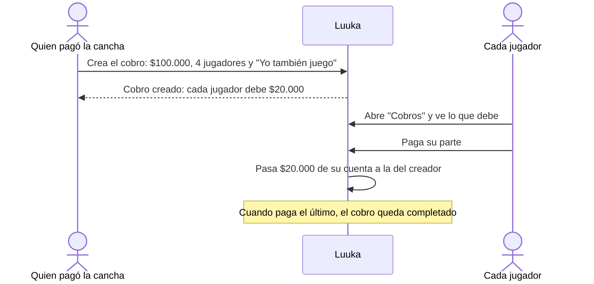
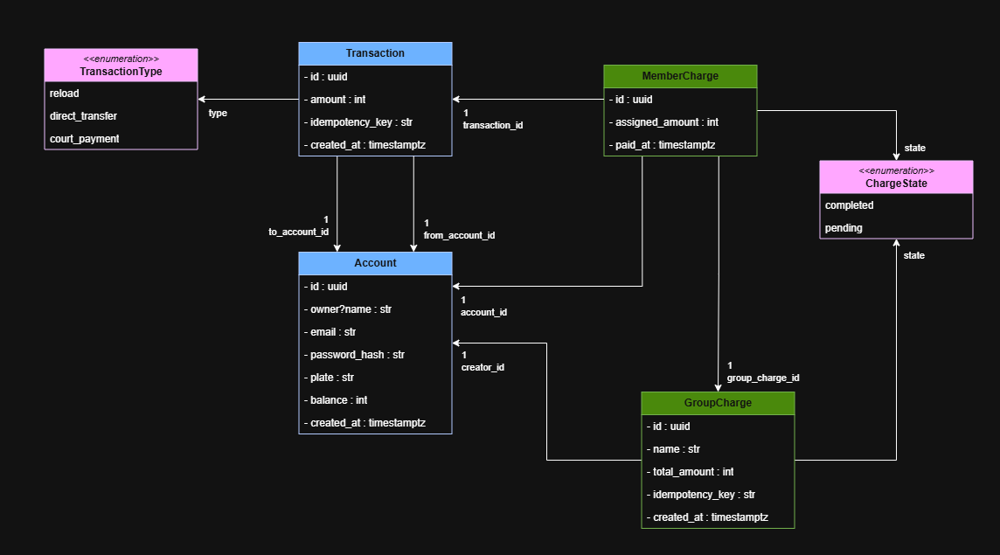
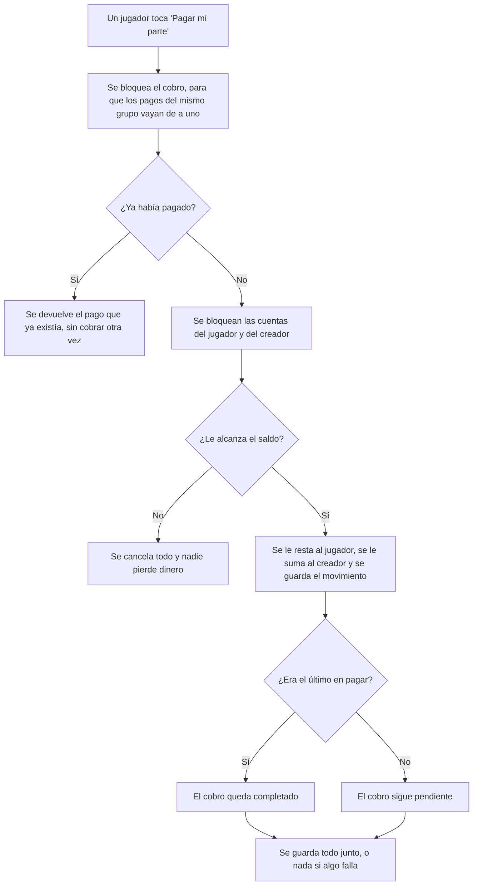

<p align="center">
  
</p>

<p align="center">
  <a href="COMO_CORRERLO.md"></a>
  <a href="backend/README.md"></a>
  <a href="frontend/README.md"></a>
</p>

Luuka es una billetera digital para mover dinero entre personas de forma rápida y sin fricción, sin tener que pasar por un banco. Cada usuario tiene una cuenta que se identifica con una **placa**, por ejemplo `ABC-123`, y con esa placa cualquiera le puede transferir dinero fácilmente.

El repositorio tiene dos partes:

- [`backend/`](backend/README.md): la API.
- [`frontend/`](frontend/README.md): la aplicación web.

## Dividir la cancha

Me enfoqué en un problema concreto: pagar una cancha entre todos los del equipo.

Casi siempre una persona paga la cancha y después les cobra a los demás. Mientras se hace la división, alguien se demora con la transferencia o no le llega a tiempo, y ya todos se quieren ir al tercer tiempo. La idea es que el pago y la logística sean rápidos.

Por eso Luuka tiene una función para dividir lo que costó la cancha en partes iguales y que cada jugador pague su parte desde su cuenta:

1. Quien pagó la cancha crea un **cobro grupal** con el total y agrega a los demás jugadores por su placa.
2. Si él también jugó, marca **"Yo también juego"** y su parte se descuenta del total. Por ejemplo, si la cancha costó $100.000 y jugaron 5, cada uno de los otros 4 paga $20.000.
3. Cada jugador ve en la app cuánto debe y paga con el saldo de su cuenta. El dinero le llega directo a quien pagó la cancha.
4. Cuando paga el último, el cobro queda completado.



## ¿Por qué este problema?

Me apasiona el fútbol y me gusta jugar, pero al momento de pagar siempre alguien sale descuadrado, ya sea porque no hizo bien la cuenta o porque alguien no le pagó. Con Luuka las cuentas quedan divididas al instante y en partes iguales. Cada uno ve en su app cuánto debe pagar y lo puede hacer rápido con el dinero de su cuenta.

## ¿Cómo está estructurado?



---

## 01. Las decisiones clave y por qué las tomé

### Cómo se mueve el dinero en la base de datos

La decisión más importante fue cómo manejar las transacciones en la base de datos:

- **Todo o nada.** Cada operación que mueve dinero (recarga, transferencia o pago de la cancha) se hace en una sola transacción de la base de datos. Si algo falla en la mitad, se deshace todo. Así nunca pasa que el dinero salga de una cuenta y no llegue a la otra.
- **Bloqueo de las cuentas.** Antes de mover dinero, bloqueo las cuentas que participan (`SELECT ... FOR UPDATE`). Si llegan dos operaciones al mismo tiempo sobre la misma cuenta, la segunda espera a que termine la primera y lee el saldo ya actualizado.
- **Siempre en el mismo orden.** Las cuentas se bloquean ordenadas por su id. Así, dos transferencias cruzadas (A le manda a B y B le manda a A al mismo tiempo) no se quedan esperándose la una a la otra.
- **Pesos enteros.** Los montos se guardan como números enteros en pesos, sin decimales, para no tener errores de redondeo.
- **Reglas en la base de datos.** El saldo no puede ser negativo y los montos tienen que ser mayores a cero. Si por un error el código intentara romper eso, la base de datos lo rechaza.

### La placa

Decidí identificar a cada usuario con una placa. Los bancos dan un número de cuenta larguísimo que nadie se sabe de memoria. Una placa de tres letras y tres números es mucho más fácil de recordar, como la placa de un carro.

### El dinero va directo al creador del cobro

También tuve que decidir cómo recibe el dinero quien creó el cobro de la cancha. Una opción era retener el dinero hasta que todos pagaran, pero eso significaba tener dinero "volando" que no se ve bien reflejado en las cuentas de nadie.

Por eso cada pago es una transacción normal: sale de la cuenta del jugador y entra de una vez a la del creador. En cada pago se revisa si ya pagaron todos, y cuando paga el último el cobro queda completado.

## 02. Cómo sé que el sistema no pierde un peso

### Qué puede salir mal

- Que se cobre dos veces la misma operación, por ejemplo si el usuario le da doble clic o si se cae el internet y la app reenvía la petición.
- Que dos operaciones al mismo tiempo lean el mismo saldo y gasten dinero que no hay.
- Que algo falle en la mitad y el dinero salga de una cuenta sin llegar a la otra.
- Que un jugador pague dos veces su parte de la cancha.
- Que al dividir la cancha se pierdan o sobren pesos por el redondeo.
- Que un monto llegue como texto, por ejemplo `"50.000"`, y se lea como 50.

### Cómo lo protejo

- **Operaciones repetidas:** la app le pone un código único a cada operación (`Idempotency-Key`). Si la misma operación llega dos veces con el mismo código, el backend no la vuelve a hacer y devuelve la que ya había hecho.
- **Operaciones al mismo tiempo:** se bloquean las cuentas antes de leer el saldo, como expliqué en la sección 01.
- **Fallas en la mitad:** todo va en una sola transacción, así que si algo falla no se guarda nada.
- **Pagar dos veces la cancha:** si un jugador paga una parte que ya estaba pagada, el backend devuelve el pago que ya existía y no cobra otra vez.
- **Redondeo:** la división se hace en pesos enteros y los pesos que sobran se asignan a alguien, así que la suma de las partes siempre da el total. Si el creador juega, los pesos que sobran quedan en su parte, para que ningún jugador pague más que los demás.
- **Montos como texto:** el backend solo acepta montos que sean números enteros. Un texto como `"50.000"` se rechaza.

Así funciona el pago de una parte de la cancha:



### Qué evidencia tengo de que funciona

El backend tiene tests automáticos (`pytest`) que revisan estos casos, entre otros:

- Una recarga, una transferencia o un cobro grupal repetido con la misma `Idempotency-Key` se aplica una sola vez.
- Una transferencia o un pago sin saldo suficiente responde con error y no cambia ningún saldo.
- Pagar dos veces la misma parte de la cancha solo cobra una vez.
- La división de la cancha siempre suma el total, con y sin el creador.
- Montos con decimales o como texto se rechazan.
- Transferencias en las dos direcciones al mismo tiempo dejan los saldos correctos.
- Si todos los jugadores pagan al mismo tiempo, el cobro queda completado y el creador recibe exactamente el total.

En [COMO_CORRERLO.md](COMO_CORRERLO.md#tests-por-caso) está el comando para correr los tests de cada caso.

### Revisión de los saldos

Cada movimiento queda guardado, así que el saldo de una cuenta se puede recalcular sumando lo que entró y restando lo que salió. Hay un comando que hace esa revisión para todas las cuentas:

```bash
docker compose exec backend python -m app.db.check_balances
```

Revisa dos cosas:

- Que el saldo guardado de cada cuenta sea igual a lo que dicen sus movimientos.
- Que la suma de todos los saldos sea igual a todo lo que se ha recargado. El dinero solo entra por las recargas y nunca sale del sistema, así que si esos dos números no son iguales, se creó o se perdió un peso en algún lado.

Si todo cuadra, lo dice y termina bien. Si algo no cuadra, muestra qué cuenta tiene el problema y termina con error. El comando solo lee: nunca corrige un saldo por su cuenta, para que el problema quede visible hasta que alguien lo revise.

También tiene tests. Uno hace de todo (recargas, transferencias, reintentos con la misma `Idempotency-Key`, una transferencia sin saldo y un pago de la cancha repetido) y al final revisa que todo cuadre. Otro cambia un saldo directo en la base de datos, simulando un error, y revisa que el comando lo detecte.

## 03. Qué dejé fuera y por qué

Dejé fuera la opción de cancelar un cobro de la cancha. Si algunos jugadores ya habían pagado su parte, había que devolverles el dinero, y eso me hizo pensar que podían quedar inconsistencias en los saldos. Además, agregaba varias validaciones extra.

## 04. Qué haría distinto con más tiempo

- Implementaría la cancelación de cobros con reembolsos.
- Agregaría más funciones, como poder retirar dinero.
- Usaría un servicio externo de autenticación, para no tener que guardar contraseñas ni hacer esas validaciones nosotros mismos.

## 05. Qué NO sé

Los tests los escribió 100% la IA. Entiendo qué prueban y por qué funcionan, pero el código de los tests lo escribió un editor con IA, no yo.

La `Idempotency-Key` también fue idea de la IA. Me la sugirió para evitar que se dupliquen transacciones o cobros. Investigando entendí para qué sirve, pero no es algo que maneje normalmente.

## 06. Los supuestos que hice y por qué

- **La app se usa desde el celular.** Por eso el frontend está hecho en React como una web, pero con un diseño de celular. Así podía prototipar rápido y mostrar cómo se vería en un teléfono.
- **Las personas comparten su placa en el momento.** Supuse que, al crear el cobro, los jugadores le dicen su placa al creador y él los va agregando uno por uno.
- **La moneda es el peso colombiano (COP).** Es el contexto en el que estoy pensando y donde he visto que pasa este problema.

## 07. Cómo usé la IA

### Herramientas, dinámica y etapas

- **Diseño, con Gemini.** Al principio le planteé lo que quería hacer y con su ayuda enfoqué mejor la idea y su propósito. Empecé a definir las entidades y sus relaciones hasta llegar al diagrama UML.
- **Backend, primero por mi cuenta.** Con el diseño listo, construí el backend en FastAPI. Hice el núcleo de cuentas y transacciones.
- **Revisión y mejoras, con Claude Code.** Le pedí que actuara como auditor de mi código y me diera observaciones. Muchas me parecieron útiles: nombres de atributos, archivos de configuración, relaciones y cómo organizar los servicios. Después le pedí que actuara como desarrollador e implementara las que escogí. Así fui mejorando al mismo tiempo el código, la idea y el diseño.
- **Lo demás, también con Claude Code.** Le pedí los README de cada carpeta, los tests para validar que el backend siguiera funcionando después de cada cambio y el `docker-compose` para levantar la base de datos, el backend y el frontend más fácil.
- **Frontend.** Aquí la IA me ayudó muchísimo. Como ya tenía el contexto de los endpoints del backend, le pedí que los integrara y creara las vistas necesarias, con un estilo minimalista y un diseño pensado para celular.

### Qué le pedía y qué decidía yo

Yo decidía la idea, el problema a resolver, las entidades y las reglas del negocio. De las sugerencias de la IA escogía cuáles aplicar y cuáles no. A la IA le pedía sobre todo revisar, proponer e implementar lo que ya habíamos decidido.

### Cuándo la IA se equivocó (o casi me hizo equivocar)

En el diseño con Gemini, como el problema todavía era un poco ambiguo, asumió que la moneda era USD cuando yo estaba pensando en COP. Por eso me propuso tipos de datos que no eran los correctos.

También me sugirió guardar los tipos y estados como texto. Me di cuenta de que eso podía ser un problema y que iba a necesitar más validaciones, por ejemplo para saber si `transaccion` y `Transacción` son lo mismo. Preferí usar enums.

Con Claude Code pasó algo parecido en el frontend. Al construir la vista para dividir la cancha, la IA siguió una regla del backend en la que quien pagaba la cancha no ponía su parte: si la cancha costaba $100.000 y éramos 5, cada uno de los otros 4 pagaba $25.000. Me di cuenta al revisar el campo "¿Cuánto pagaste en total?" y preguntarle qué se estaba enviando. Lo cambiamos para que el creador pueda marcar "Yo también juego" y cada uno pague $20.000.

## 08. Qué aprendí

### Qué es nuevo para mí

Aprendí a usar React creado con Vite. Siempre lo había usado con Next.js, pero esta vez la IA me sugirió Vite porque es mucho más rápido. Ya tenía las bases de TypeScript y React, así que no fue nada del otro mundo.

### Qué me llevo

Me gustó mucho esta idea y siento que sería muy útil como función de una billetera digital que usemos todos los días. En Colombia tenemos la costumbre de "hacer vaca" y dividir cuentas entre varias personas, no solo en el fútbol. Normalmente alguien tiene que coordinar: hacer la división, cobrarle a cada uno y recordarle su número de cuenta para que le transfieran. Para mí es mejor que ese coordinador sea el sistema y que sea él quien le cobre a cada uno.
