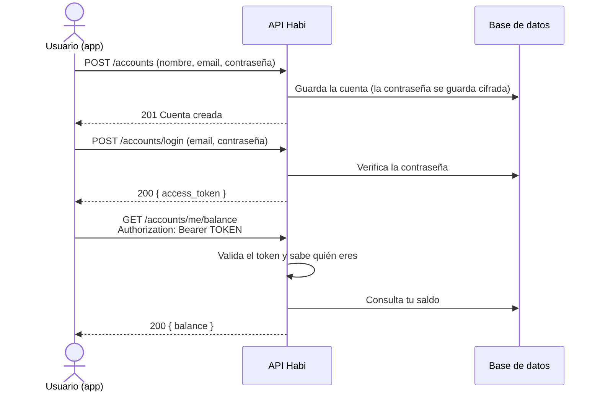
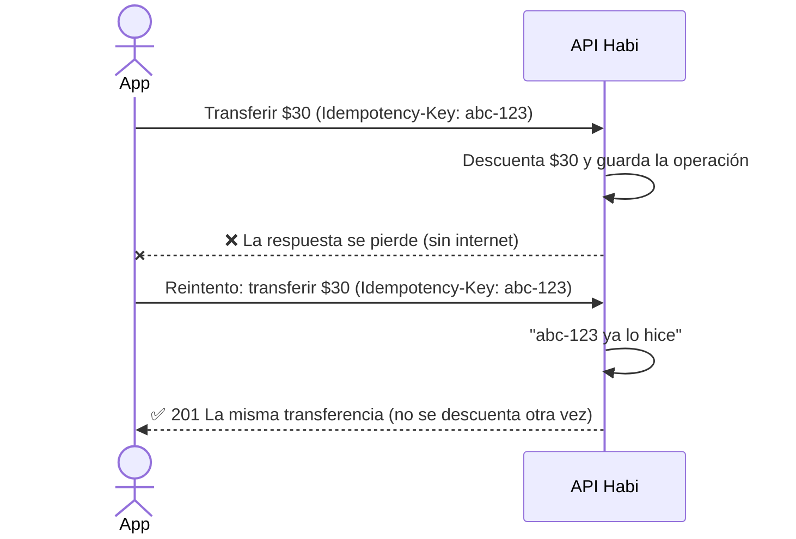

# Lukas - Backend

API de una billetera digital. Permite:

- Crear una cuenta e iniciar sesión.
- Recargar saldo.
- Transferir dinero a otra cuenta.
- Consultar el saldo y el historial de movimientos.

---

## ¿Qué necesito?

| Herramienta | Versión         | Para qué          |
| ----------- | --------------- | ----------------- |
| Python      | 3.12 o superior | Ejecutar la API   |
| PostgreSQL  | 14 o superior   | Guardar los datos |

---

## Cómo ejecutarlo

Despues cuando se haga el dockerfile, se actualizara este parte

---

## ¿Cómo funciona la autenticación?

Casi todos los endpoints necesitan saber **quién** hace la petición. Para eso se usa un **token** que recibes al iniciar sesión:

1. Creas tu cuenta con email y contraseña.
2. Inicias sesión y la API te entrega un token.
3. Envías ese token en cada petición, en el header `Authorization: Bearer <token>`.
4. El token vence a los 30 minutos (configurable). Cuando vence, vuelves a iniciar sesión.



---

## Endpoints

🔒 = necesita token.

| Método | Ruta                           | Qué hace                            |
| ------ | ------------------------------ | ----------------------------------- |
| GET    | `/health`                      | Comprueba que la API está encendida |
| POST   | `/accounts`                    | Crea una cuenta                     |
| POST   | `/accounts/login`              | Inicia sesión y entrega un token    |
| GET    | `/accounts/me/balance` 🔒      | Muestra tu saldo                    |
| GET    | `/accounts/me/transactions` 🔒 | Muestra tu historial de movimientos |
| POST   | `/transactions/reloads` 🔒     | Recarga saldo en tu cuenta          |
| POST   | `/transactions/transfers` 🔒   | Transfiere dinero a otra cuenta     |

---

## ¿Qué es el header `Idempotency-Key`?

Sirve para que **una operación no se cobre dos veces** si la app la reenvía, por ejemplo cuando se cae el internet justo después de enviar una transferencia y la app no sabe si se hizo.

La app genera un código único cuando el usuario toca "Transferir" (o "Recargar") y lo envía en el header `Idempotency-Key`. Si ese mismo código vuelve a llegar, la API no repite la operación: devuelve la que ya hizo.



**Regla para la app:**

- **Misma clave** si no sabes si la operación funcionó: se cayó la red, hubo un timeout o un error 5xx.
- **Clave nueva** cuando el usuario inicia otra operación.
- Si reutilizas una clave con otros datos (otro monto u otro destino), la API responde `422`.

El header es opcional. Sin él, cada petición se procesa como una operación nueva.

---

## Errores: qué significa cada código

Todas las respuestas de error tienen la forma `{ "detail": "mensaje" }`.

| Código | Significado                                                                               |
| ------ | ----------------------------------------------------------------------------------------- |
| `400`  | La operación no se puede hacer (saldo insuficiente, transferencia a ti mismo)             |
| `401`  | Falta el token, es inválido o venció. También si el email o la contraseña son incorrectos |
| `404`  | La cuenta indicada no existe                                                              |
| `409`  | El email ya está registrado                                                               |
| `422`  | Los datos enviados no son válidos                                                         |

---

## Tests

### Instalar las herramientas de pruebas

```bash
pip install -r requirements-dev.txt
```

### Ejecutar los tests

Desde la carpeta `backend/`:

```bash
pytest
```

---

## Estructura del proyecto

```
backend/
├── app/
│   ├── main.py            # Punto de entrada de la API
│   ├── core/              # Configuración, seguridad, errores y autenticación
│   ├── db/                # Conexión a la base de datos y creación de tablas
│   ├── models/            # Tablas de la base de datos
│   ├── schemas/           # Formato de los datos que entran y salen de la API
│   ├── services/          # Lógica de negocio (cuentas, transacciones)
│   └── routers/           # Endpoints
├── tests/                 # Pruebas automáticas
├── .env.example           # Plantilla de configuración
├── requirements.txt       # Dependencias de la API
└── requirements-dev.txt   # Dependencias para los tests
```
